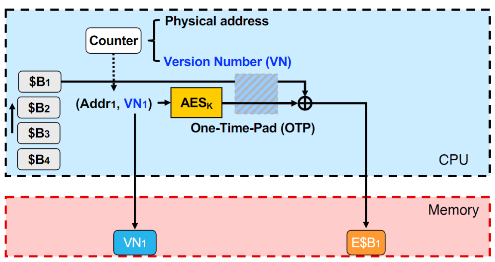

# An universal design of heterogenous TEEs

## Background

Heterougenous TEEs have been well studied in recent years, e.g., GPU TEEs like Graviton, HIX, H100, Graphcore IPU Trusted Extensions (ITX), FPGA TEEs like SGX-FPGA, ShEF, TEEOD and others like Iceclave, SecNDP, PIM-Enclave. This report concludes a common design prototype of them and try to find the chance to optimize them.

### Root of Trust

The basis of TEEs comes from hardware features and firmware for access control, encryption and communication. The paradigm usually contains the hardware to isolate confidential data and code and the 
<!-- root of trust: hardware feature and firmware for access control, encryption and communication -->
<!-- specialized instructions -->
<!-- PCIe, DMA -->
<!-- X86 adopts the independent addressing method to separate the memory operation from the peripheral IO operation, so that there is a distinction between the memory space and the IO space. The instructions for accessing memory and peripheral registers within the X86 platform CPU are also different. -->

## MGX

For confidentiality, must encrypt data blocks in memory
– Randomization required to prevent comparing two blocks
For integrity, must check if a memory read returns the most recent value
(that is stored at the address by an accelerator)
||
|:--:|
| *Memory Encryption: Counter Mode* |

Previous techniques introduce AES counter mode for memory encryption which uses *(address, version number)* as seed to produce One-Time-Pad (OTP) keys and encrypts data [^4][^3]. The version number (VN) are managed by a Merkle Tree for integrity verification. Therefore, MGX stores the metadata (VNs and MACs) in the off-chip memory cache-line by cache-line and verifies the VNs recursively while fetching the data.

MGX observes that the memory access patterns and granularity can be largely determined for a particular application [^3]. For example, data accesses to NN models happen at a coarser granularity, i.e., layer. 

## Memory Encryption: Counter Mode

AES-CTR (Counter mode) is a member of AES cryptography family which turns a block cipher into a stream cipher. It generates the next keystream block by encrypting successive values of a "counter". The counter can be any function which produces a sequence which is guaranteed not to repeat for a long time, although an actual increment-by-one counter is the simplest and most popular [^1]. Counter mode can encrypt and tranfer data blocks in parallel and decrypt them as the same manner. Therefore, AES-CTR can be accelerated better than other AES variants.
||
|:--:|
| *Counter mode encryption* |
||
| *Counter mode decryption* |

Block ciphers can be extracted from block groups or generated by cryptographically secure pseudorandom number generators (CSPRNGs). Synthetic Initialization Vector (SIV) is a block cipher mode of operation [^2]. It takes a key, a plaintext, and multiple variable-length octet strings that will be authenticated but not encrypted. It produces a ciphertext having the same length as the plaintext and a synthetic initialization vector. SIV achieves either the goal of deterministic authenticated encryption or the goal of nonce-based, misuse-resistant authenticated encryption.

## PRNG mode

After users build trust with TEEs by the attestation, the communication between TEEs can be a performance bottleneck. Hardware features like AES-NI can be a good solution, but there is still an another option. Let the TEEs negotiate a PRNG seed, they can generate the same OTP keys which have the same length of the plaintext. Then the XOR operation can deal with the encryption and decryption.

Unlike symmetric encryption which takes multiple operations, the PRNG mode can generate the keys ahead and decrypt the ciphertext faster. 

## References

[^1]: https://en.wikipedia.org/wiki/Block_cipher_mode_of_operation.
[^2]: Harkins, D. (2008). Synthetic initialization vector (siv) authenticated encryption using the advanced encryption standard (aes) (No. rfc5297).
[^3]: Hua, W., Umar, M., Zhang, Z., & Suh, G. E. (2022, June). MGX: near-zero overhead memory protection for data-intensive accelerators. In Proceedings of the 49th Annual International Symposium on Computer Architecture (pp. 726-741).
[^4]: Gueron, S. (2016). Memory encryption for general-purpose processors. IEEE Security & Privacy, 14(6), 54-62.