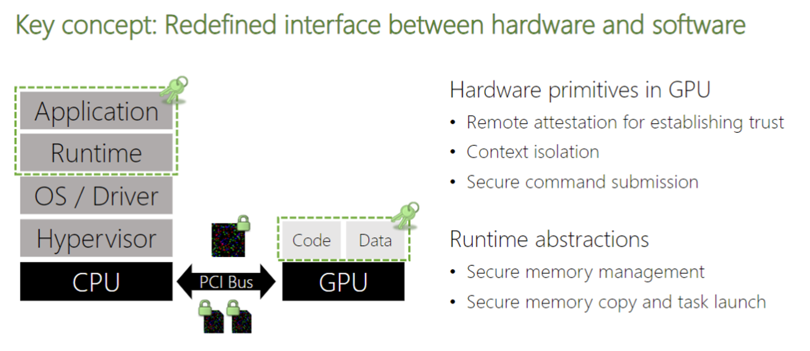
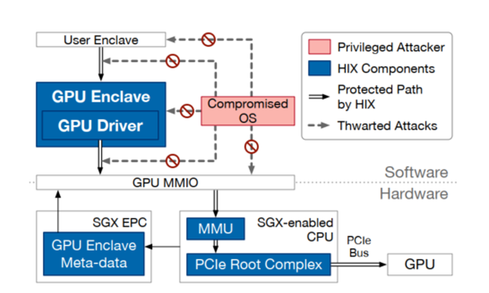
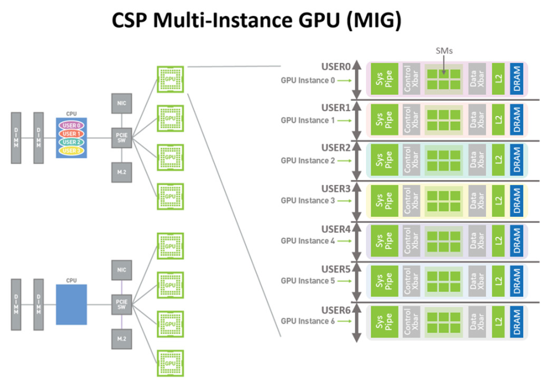
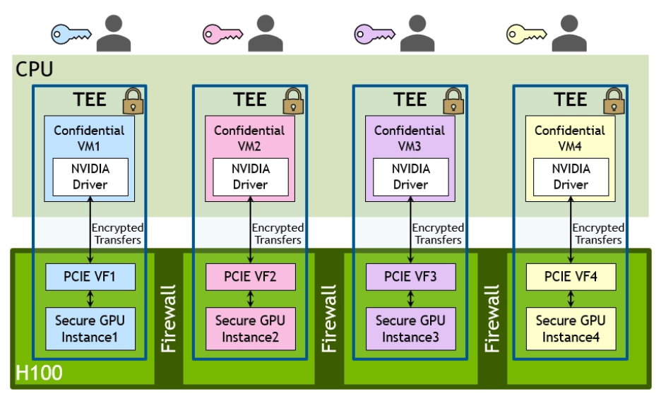
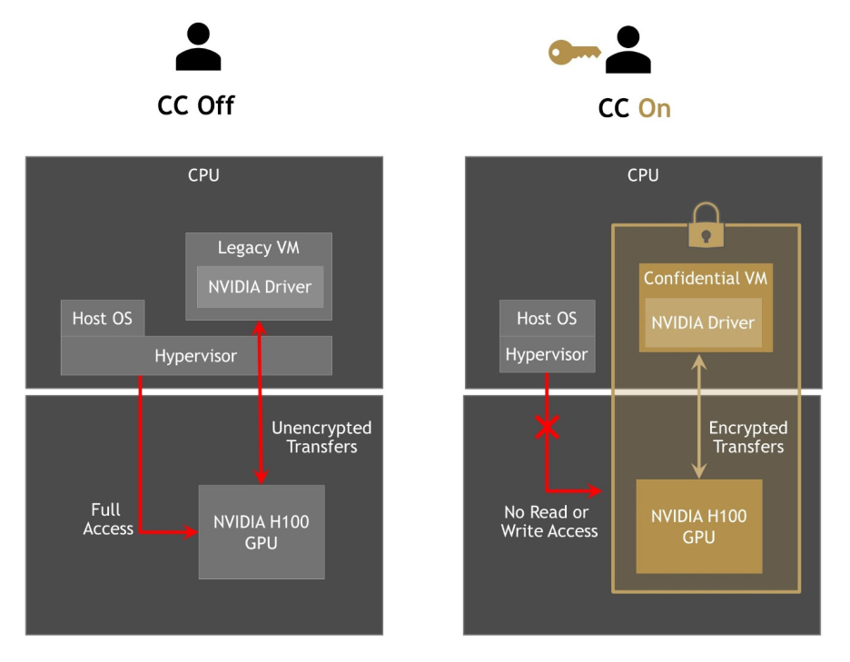

# Thoughts about NVIDIA H100

## 1. Confidential Computing

Confidential Computing (CC) has caught much attention with the growing demands of data security. Unlike TPM and Homomorphic Encryption, Confidential Computing proposes detailed standards to create a hardware-based Trusted Execution Environment (TEE) to protect data confidentiality, data integrity and code integrity and perform computations [^5].

Recently, heterogeneous hardware has become an indispensable part of datacenters for high performance computing. However, existing commercial TEE solutions like Intel SGX and AMD SEV are CPU-based which provides high versatility but lacks the ability to finish compute-intensive workloads. GPU may be the most popular peripheral to accelerate general computing.

Graviton[^2] in OSDI'18 and HIX[^3] in ASPLOS'19  give the insights of the principle of GPU TEE, but they suffer from huge overheads and are not available for use. Graviton presents an architecture which guarantees confidentiality and integrity for applications by hardware-enforced isolation of GPU and CPU TEE. HIX transforms the GPU into an extension of the current SGX enclave by removing key functions of the GPU driver from the operation system and relocating them in a separate process in the enclave. They are different by high-level design. For example, HIX is more like an extension than an GPU enclave. Graviton has a stronger threat model, and Graviton needs a full attestation like other TEEs while HIX leverages attestation of GPU enclave as part of CPU enclave attestation. But in common, they isolate the secure hardware I/O path by blocking MIMO from the operation system.
||
|:--:|
| *Graviton architecture* |
||
| *HIX architecture* |
<!-- #### Graviton -->

<!-- #### HIX -->

## 2. NVIDIA H100
<!-- ### Root of Trust -->

NVIDIA unveiled the Hopper DGX H100 GPU in GTC 2022, designed for the next generation of data centers. It provides speed-ups over all precisions(FP64, TF32, FP32, FP16, FP8 and INT8) [^7]. The units contains:

- 8 GPCs, 72 TPCs (9 TPCs/GPC), 2 SMs/TPC, 144 SMs per full GPU
- 128 FP32 CUDA Cores per SM, 18432 FP32 CUDA Cores per full GPU
- 4 Fourth-Generation Tensor Cores per SM, 576 per full GPU
- 6 HBM3 or HBM2e stacks, 12 512-bit Memory Controllers
- 60 MB L2 Cache
- Fourth-Generation NVLink and PCIe Gen 5

The most inspiring thing is the support of new **Confidential Computing (CC)**. This is the first commercial GPU with Confidential Computing capabilities.

### 2.1. Threat model

Similar to CPU TEEs, H100 assumes that the OS/hypervisor are malicious and there is an adversary who can gain the full control over the software and hardware outside the TEE. Therefore, an attacker can easily launch snooping attacks by controlling the PCIe bus and memory. Moreover, the adversary can access or tamper with user data in DMA buffers or with commands submitted by the victim application to the GPU. The adversary may access device memory directly over MMIO or map the GPU context to the victim's memory space. The attacker could also dispatch malicious kernels to the GPU to access illegal context under multi-user scenario.

Specifically, the CPU TEE, GPU TEE and GPU firmware are trusted. The adversary is not able to sniff secrets inside the TEEs or exploit the GPU runtime to break the isolation. Side-channel attacks, deny-of-service and the limitations inherited from CPU TEEs are out of scope.

### 2.2. Isolation

#### 2.2.1. On-Die Root of Trust (RoT)

The RoT is composed of a set of hardware features which provide memory region protection, access control and other security capabilities.

<!-- secure MIG -->
#### 2.2.2. NVIDIA Multi-Instance GPU (MIG)

MIG technology allows partitioning of each A100 or H100 GPU (both H100 SXM5 and H100 PCIe versions) into as many as seven GPU Instances for optimal GPU utilization. MIG generates many vGPUs for VMs and each GPU instance has separate and isolated paths by independent on-chip crossbar ports, L2 cache banks, memory controllers, and DRAM address busses[^1].
||
|:--:|
| *MIG Configuration* |
Accounting for the needs of TEEs, H100 enhances MIG by hardware firewalls between GPU instances to protect confidentiality and data integrity.
||
|:--:|
| *Secure MIG Example* |
<!-- CPU confidential VM -->
<!-- ##### CPU confidential VM -->
#### 2.2.3. Customized Datapath

Like other GPU TEEs, NVIDIA TEEs act as agencies of CPU TEEs. A confidential VM on GPU requires a corresponding counterpart on CPU. However, H100 makes this connection closer. Data transfers between the CPU and H100 GPU are encrypted/decrypted at PCIe line rate using a hardware implementation of AES256-GCM[^1].

H100 provides two modes: Secure(CC On) and Normal(CC Off), like ARM TrustZone. It behaves like ordinary GPUs under Normal mode, and when switching to Secure mode, it blocks communication with the host OS or hypervisor. Only the encrypted data transfers between CPU TEE and GPU TEE are allowed. In Graviton, the MIMO is blocked for Secure mode.
||
|:--:|
| *Normal Mode VS Secure Mode* |
<!-- mode switching -->
<!-- three components -->

### 2.3. Attestation
<!-- Measurement -->
Besides secure boot technology, H100 implements a new component, measured boot, for collecting, securely storing, and reporting characteristics of the boot process that determines the GPU’s secure state. Here, we can regard it as the initialization of a long-running SGX enclave. The measurement of H100 is determined once launched and the uesr can compare it with reference values provided by NVIDIA or service providers. This also avoids great overhead of initialization unlike Graviton and HIX.

## 3. Discussion

NVIDIA mentioned Federated Learning as a typical user case. Actually, H100 presents an opportunity for all deep learning instances with security demands as it requires no changes of CUDA application code changes. The combination of confidential VM and GPU TEE virtualizes a secure machine which can almost finish all workloads like an untrusted environment.
<!-- large trust computing base -->
<!-- potential research field -->
### 3.1. Secure MLaaS
<!-- previous work and drawbacks -->
**Pure TEE approach.** Previous work like TensorSCONE, Occlumency, Myelin, Vessels, Lasagna and so on can be mitigated to H100 directly. The workload (small DL models) can be directly dispatched to the GPU TEE. Secure paging is no longer an issue.

**TEE with heterogeneous devices.** Slalom and DarKnight are typical examples of accelerating linear operator computation by cheap crypto tools. Outsourcing linear layers can not only accelerate computations but also cut down the memory footprint of the enclave. Telekine [^4] is a practice of applying GPU TEE and accelerating NN inference. Large EPC size alleviates the pressure of secure paging and GPU TEE brings global speed-up of the DL model. Outsourcing computing seems to be a supplement to GPU TEEs. The optimization tends to fall on the scheduling or the elimination of initialization under such a scenario.

**Training.** It would be interesting to train a large model with a huge dataset. What if the VRAM is not enough? Will the communication cost be critical? How do different GPU TEEs cooperate?

### 3.2. Bottleneck of Performance
<!-- communication? or others in system design -->
Actually, Graviton and HIX all suffer from communication overhead. Secure memory copy between the CPU and the GPU are expensive for key generation and encryption. H100 optimizes it by hardware features (i.e., AES acceleration) as reported in [^1]. But it can still be the bottleneck on workloads with frequent data exchange. For example, the gradients sychronization in distributed learning can meet a sharp increase of communication overhead. This may make traditional data parallel method a good choice as usual.

### 3.3. Security issues
<!-- the cooperation of different TEEs -->
<!-- the attestation flaws or the protocol design -->
NVIDIA did not give detailed security arguments in the whitepaper. Large trust computing base (TCB) usually brings security concerns, especially I/O operations. H100 enlarges TCB by extending the confidential VM on the CPU with a GPU TEE and its kernels. Memory integrity protection is necessary to prevent hypervisor-based attacks like replay attack, memory re-mapping. AMD SEV-SNP (Secure Nested Paging) has claimed to provide such protection[^6]. And in Graviton, a counter as initialization vector is stored in a protected memory region for integrity. However, as described in H100's white paper, the barely encrypted data stream does not provide strong integrity protection. Maybe the CPU TEE can help to set up a counter or undertake the verification task.

The details of attestation procedure on GPU TEEs and "firewalls" enforcing strong isolation are also not revealed in [^1] now. They could be a good topic then. For example, how to build connections between GPU TEEs, NVlink or CPU-centered? Does a confidential VM have to attest every TEE which can result in great overhead?

### 3.4. Acceleration other workloads
<!-- graph? -->
Other workloads can also motivate an GPU-TEE specific design except ML. Are there any new challenges when applying H100 to traditional workloads? Some researches move data-intensive and compute-intensive tasks like graph processing to GPU [^8][^9]. The optimization of memory divergence and load imbalance on GPU TEEs could be a good topic.

## *To be filled by more details ...*
<!-- #### OS support for secure I/O
<!-- secure interface management for large TCB -->
<!-- new problem -->
<!-- Larger TCB may expose larger attacking surface. I/O devices are widely used and can be vulunrable to adversaries. I/O operations like Disk I/O, Network I/O and Display I/O can be protected by simple encryption. Nevertheless, the  -->

## References

[^1]: NVIDIA(2022). NVIDIA H100 Tensor Core GPU Architecture.
[^2]: Volos, S., Vaswani, K., & Bruno, R. (2018). Graviton: Trusted Execution Environments on {GPUs}. In 13th USENIX Symposium on Operating Systems Design and Implementation (OSDI 18) (pp. 681-696).
[^3]: Jang, I., Tang, A., Kim, T., Sethumadhavan, S., & Huh, J. (2019, April). Heterogeneous isolated execution for commodity gpus. In Proceedings of the Twenty-Fourth International Conference on Architectural Support for Programming Languages and Operating Systems (pp. 455-468).
[^4]: Hunt, T., Jia, Z., Miller, V., Szekely, A., Hu, Y., Rossbach, C. J., & Witchel, E. (2020). Telekine: Secure Computing with Cloud {GPUs}. In 17th USENIX Symposium on Networked Systems Design and Implementation (NSDI 20) (pp. 817-833).
[^5]: Confidential Computing Consortium. (2021). Confidential Computing: Hardware-Based Trusted Execution for Applications and Data. <https://confidentialcomputing.io/white-papers-reports/>
[^6]: SEV-SNP, A. M. D. (2020). Strengthening VM isolation with integrity protection and more. White Paper, January.
[^7]: <https://www.nvidia.com/en-us/data-center/h100/>.
[^8]: Ma, L., Yang, Z., Chen, H., Xue, J., & Dai, Y. (2017). Garaph: Efficient {GPU-accelerated} Graph Processing on a Single Machine with Balanced Replication. In 2017 USENIX Annual Technical Conference (USENIX ATC 17) (pp. 195-207).
[^9]: Sha, M., Li, Y., He, B., & Tan, K. L. (2017). Technical report: Accelerating dynamic graph analytics on gpus. arXiv preprint arXiv:1709.05061.
